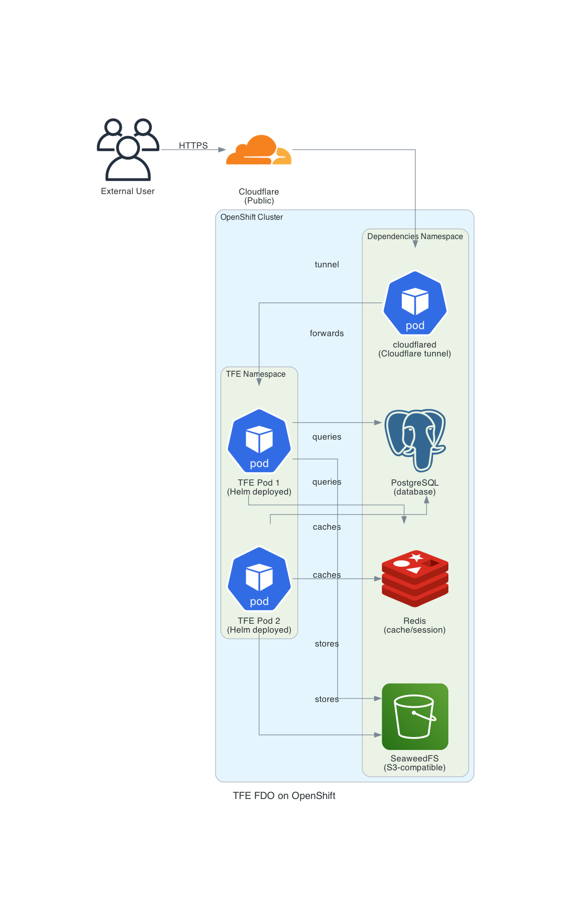

# Terraform Enterprise FDO on OpenShift

This Terraform module deploys Terraform Enterprise (TFE) in Flexible Deployment Options (FDO) mode on an existing OpenShift cluster.

## Table of Contents

- [Prerequisites](#prerequisites)
- [Architecture](#architecture)
- [Module Usage](#module-usage)
  - [Deployment](#deployment)
  - [Outputs](#outputs)
- [Proxy Configuration](#proxy-configuration)
- [Cleanup](#cleanup)

## Prerequisites

- Existing OpenShift cluster with sufficient resources
- `oc` CLI configured and authenticated to your cluster
- Cloudflare account with API token (DNS and Tunnel permissions required)
- Terraform Enterprise license

## Architecture



This module deploys the following components on your OpenShift cluster:
- PostgreSQL database
- Redis cache
- SeaweedFS for object storage
- Terraform Enterprise application
- Cloudflare tunnel for external access
- Optional Squid proxy server


## Module Usage

For a complete example of using this module, see the [`example_module_usage`](./example_module_usage) directory which contains:
- [`main.tf`](./example_module_usage/main.tf) - Example module configuration
- [`variables.tf`](./example_module_usage/variables.tf) - Variable definitions
- [`variables.auto.tfvars.example`](./example_module_usage/variables.auto.tfvars.example) - Example variable values


### Deployment

1. Initialize Terraform:
```bash
terraform init
```

2. Deploy the module:
```bash
terraform apply
```

### Outputs

After successful deployment, the module provides the following outputs:

| Output | Description |
|--------|-------------|
| `tfe_url` | Main TFE application URL |
| `tfe_admin_console` | TFE admin console URL |
| `tfe_execute_script_to_create_user_admin` | Command to create admin user |
| `postgres_port_forward_command` | Command to access PostgreSQL locally |
| `postgres_url` | PostgreSQL connection URL |
| `seaweedfs_filer_url` | SeaweedFS filer URL |
| `cloudflare_login_command` | Cloudflare CLI login command |
| `cloudflare_list_tunnels_command` | Command to list Cloudflare tunnels |
| `cloudflare_delete_tunnel_command` | Command to delete the Cloudflare tunnel |


## Proxy Configuration

To deploy an optional Squid proxy server for testing TFE in environments requiring outbound proxy:

```hcl
enable_proxy = true
```

The proxy will be available on port 3128 within the cluster.

## Cleanup

**Important:** `terraform destroy` will not automatically remove the Cloudflare tunnel.

To fully clean up:

1. Destroy Terraform resources:
```bash
terraform destroy
```

2. Manually delete the Cloudflare tunnel using the command from the outputs:
```bash
cloudflared tunnel delete tfe-tunnel-openshift
```

You can verify tunnel deletion via the Cloudflare dashboard or CLI:
```bash
cloudflared tunnel list
```